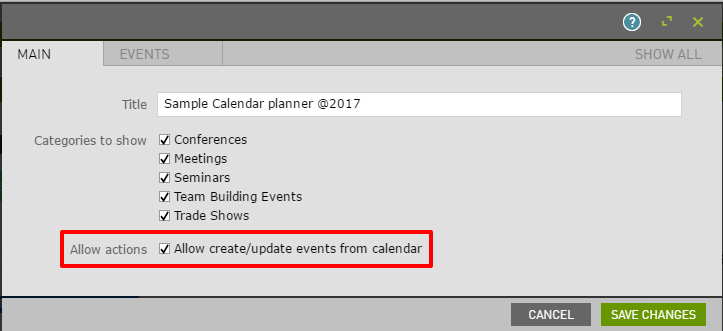
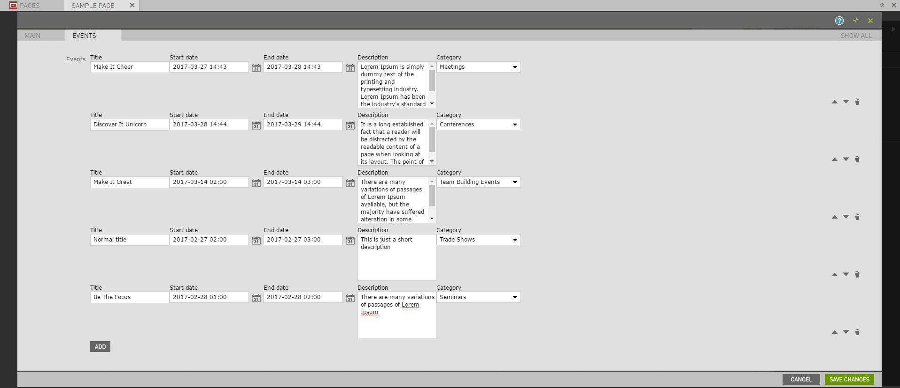
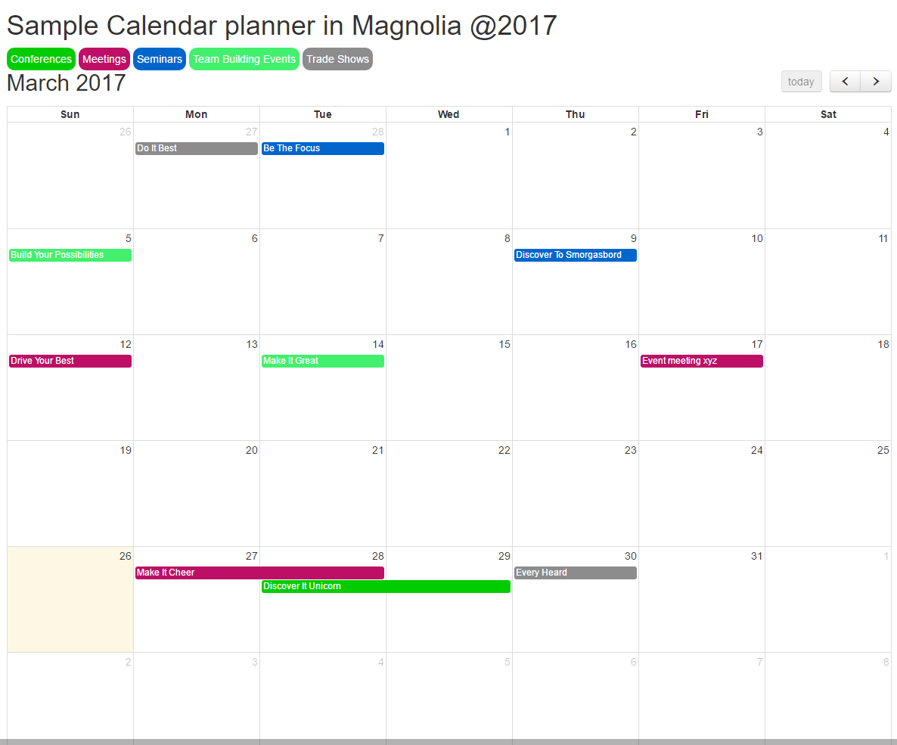
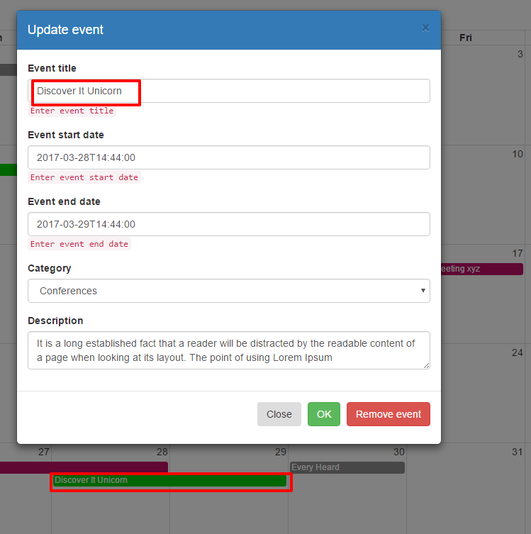
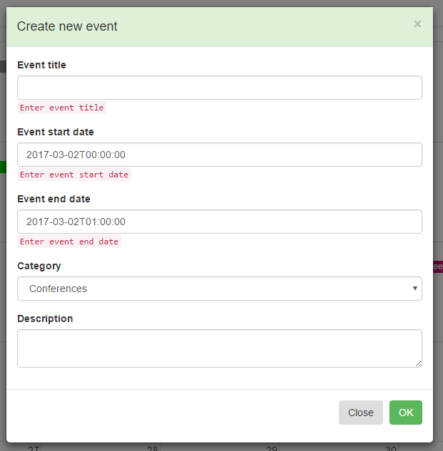

# Simple calendar planner component build in magnolia cms(FullCalendar.js, Bootstrap, Moment.js, Bootstrap datetimepicker  ...)

<!--
Simple calendar planner component build in magnolia cms(FullCalendar, Bootstrap,  ...)
Allow  users creating/update events,
-->


## Features
Offers an editor-friendly way to create/update events and with entering end/start date to show on fullcalendar
if Allow actions is selected from planner dialog other users who access the calendar page can create also events by clicking a day from 
calendar or updated their own events







<!--
Provide a list of the key features this module provides for content
authors, or whoever the primary user is. For a component template,
consider providing screenshots of the rendered component and the
component dialog.
-->


## Usage
Enable the `planner`-component  desired areas like this:<br/>
   ```yaml
   availableComponents:
       planner:
        id: planner:components/planner
   ```
Include following css files in page template header
```
    <link rel="stylesheet" href="${ctx.contextPath}/.resources/planner/webresources/css/bootstrap.min.css">
    <link rel="stylesheet" href="${ctx.contextPath}/.resources/planner/webresources/css/bootstrap-datetimepicker.min.css">
    <link rel="stylesheet" href="${ctx.contextPath}/.resources/planner/webresources/css/fullcalendar.min.css">
    <link rel="stylesheet" href="${ctx.contextPath}/.resources/planner/webresources/css/fullcalendar.print.css">
    <link rel="stylesheet" href="${ctx.contextPath}/.resources/planner/webresources/css/planner.css">
   ```
Include following js files in page template footer
```
  <script src="${ctx.contextPath}/.resources/planner/webresources/js/jquery-3.2.0.min.js"></script>
  <script src="${ctx.contextPath}/.resources/planner/webresources/js/bootstrap.min.js"></script>
  <script src="${ctx.contextPath}/.resources/planner/webresources/js/moment.js"></script>
  <script src="${ctx.contextPath}/.resources/planner/webresources/js/bootstrap-datetimepicker.js"></script>
  <script src="${ctx.contextPath}/.resources/planner/webresources/js/fullcalendar.min.js"></script>
  <script src="${ctx.contextPath}/.resources/planner/webresources/js/functionality.js"></script>
```
<!--
Provide details about how a developer can make the component template,
or other features provided by the light module, available to content
authors.

This can include any special instructions about webresources or
availability. This could include instructions on 3rd party dependencies
such as jquery.

Describe how a template can be configured with parameters if
applicable.
-->


## Information on Magnolia CMS

This directory is a Magnolia 'light module'.
https://docs.magnolia-cms.com


## License


## Contributors
